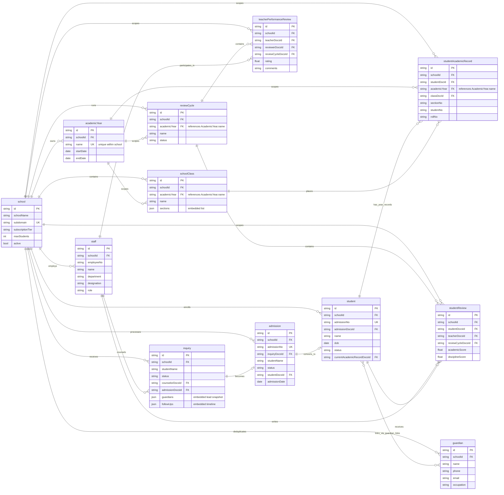

# School ERP data model

This diagram is account-independent. It can be opened in any Mermaid-compatible
Markdown viewer, VS Code Mermaid preview, Mermaid Live, or imported into a
diagram editor as `school-erp-data-model.mmd`.

## Main relationship flow

`School` scopes every domain. `AcademicYear` scopes classes, student academic
records, and review cycles. CRM `Inquiry` records can become an `Admission`,
which can become a `Student`. Students link to shared `Guardian` documents via
embedded `GuardianLink` values and to year-specific `StudentAcademicRecord`
documents. Staff members counsel inquiries and participate in student and
teacher reviews.
